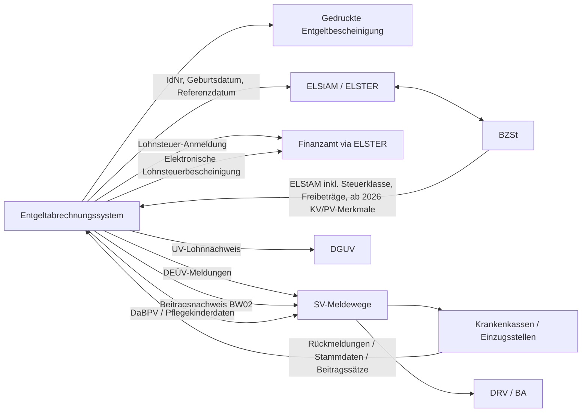

# Lohnabrechnung in Deutschland 2026

## Executive Summary

Für die **gedruckte Entgeltabrechnung** ist der rechtliche Kern in Deutschland erstaunlich klar, aber nur teilweise formstreng: § 108 GewO verlangt mindestens Abrechnungszeitraum und Zusammensetzung des Arbeitsentgelts; die **Entgeltbescheinigungsverordnung (EBV)** konkretisiert diese Mindestinhalte auf Feldniveau. Pflicht sind damit insbesondere Arbeitgeber- und Arbeitnehmeridentifikation, Beschäftigungs- und Abrechnungsdaten, Steuermerkmale, SV-Grunddaten, Brutto-/Netto-Darstellung, gesetzliche Abzüge und der Auszahlungsbetrag.

Für die **eigentliche Payroll-Verarbeitung** reichen die EBV-Felder allein nicht aus. Spätestens für den Abruf der ELStAM, die Lohnsteuer-Anmeldung, die elektronische Lohnsteuerbescheinigung, DEÜV-Meldungen, Beitragsnachweise und UV-Meldungen greifen deutlich strengere technische Regeln: feste Längen, Zeichensätze, Datumsformate, Prüfziffern, Schlüsselverzeichnisse und verfahrensspezifische Pflicht-/Bedingungslogiken.

Die wichtigsten **2026-relevanten Änderungen** für Datenmodelle sind unter anderem:
- das BMF-Muster der Lohnsteuer-Anmeldung 2026 vom 21.08.2025
- der Ausdruck der elektronischen Lohnsteuerbescheinigung 2026 vom 29.08.2025
- der PAP 2026 in endgültiger Fassung vom 12.11.2025
- die DEÜV-/Beitragsnachweis-Datensätze ab 01.01.2026
- die Stammdatendatei mit Stand 06.01.2026 und Gültigkeit ab 01.04.2026
- der Tätigkeitsschlüssel-Stand 02/2026
- die Erweiterung des ELStAM-Verfahrens um private KV/PV-Merkmale ab 01.01.2026

Die wichtigste Architekturentscheidung lautet daher: Eine rechtssichere Payroll sollte je Feld **mindestens vier Ebenen** unterscheiden — **fachlicher Wert**, **rechtlicher Pflichtstatus**, **technisches Austauschformat** und **Drucklabel**.

---

## Rechtsrahmen und Quellenhierarchie

Die maßgeblichen Primärquellen stammen insbesondere von:
- Bundesministerium für Arbeit und Soziales (BMAS)
- Bundesministerium der Finanzen (BMF)
- Bundeszentralamt für Steuern (BZSt)
- ELSTER
- GKV-Spitzenverband
- Deutsche Rentenversicherung Bund
- Bundesagentur für Arbeit
- Deutsche Gesetzliche Unfallversicherung (DGUV)
- Deutsche Bundesbank

Sinnvolle Hierarchie:
1. **Arbeitsrechtlicher Minimalinhalt** der Entgeltabrechnung aus GewO/EBV
2. **Steuerliche Verfahrensregeln** aus EStG, BMF-Mustern und ELSTER/BZSt
3. **Sozialversicherungsrechtliche Melde- und Beitragsregeln** aus SGB IV, DEÜV, GKV-Grundsätzen, Tätigkeitsschlüssel und UV-Verfahrensrecht
4. **Softwarepraxis**, in der dieselben Inhalte oft abgekürzt dargestellt werden

Wo diese Ebenen unterschiedliche Detaillierungsgrade haben, gilt für den Druck die EBV, für die Übermittlung aber das jeweils strengere technische Format.

---

## Feldkatalog

Der Katalog trennt bewusst **fachliche Payroll-Felder** von **rein transporttechnischen Datei-Headern** wie `KENNUNG`, `VERFAHREN` oder `FEHLER-ANZAHL`.

### Stammdaten und Zeitraum

| Feld | Zweck | Status | Format / Validierung | Stand |
|---|---|---|---|---|
| Arbeitgebername | Identifiziert den Arbeitgeber | Pflicht (EBV) | Druckformat nicht spezifiziert | nicht spezifiziert |
| Arbeitgeberanschrift | Eindeutige Zuordnung und Nachweisfunktion | Pflicht (EBV) | Druckformat nicht spezifiziert | nicht spezifiziert |
| Arbeitnehmername | Identifikation der Person | Pflicht (EBV); Pflicht im SV-Verfahren | DEÜV: Familienname 30 `an`, Vorname 30 `an` usw. | 12.03.2025 |
| Arbeitnehmeranschrift | Zustell- und Identifikationsfunktion | Pflicht (EBV); Pflicht im SV-Verfahren | DEÜV: PLZ 10 `an`, Ort 34 `an`, Straße 33 `an`, Hausnr. 9 `an` | 12.03.2025 |
| Geburtsdatum | Personenabgleich, ELStAM, SV | Pflicht (EBV); Pflicht im SV | DEÜV: `jhjjmmtt`; im ELStAM teils Sonderlogik möglich | 12.03.2025 |
| Versicherungsnummer | SV-Identifikation | Pflicht, soweit vorhanden | `bbttmmjjassp`, 12-stellig mit Prüflogik | 12.03.2025 |
| Beschäftigungsbeginn | Beginn des aktuellen Verhältnisses | Pflicht (EBV) | Datum; Druckformat nicht spezifiziert | 12.04.2013 |
| Beschäftigungsende | Ende des Verhältnisses | Bedingt | Nur bei letzter Bescheinigung | 12.04.2013 |
| Abrechnungszeitraum | Zeitraum der Abrechnung | Pflicht (EBV) | Monat oder `von–bis` | 12.04.2013 |
| Steuertage | Steuerliche Periodisierung | Pflicht (EBV) | Numerisch; Drucklänge nicht spezifiziert | nicht spezifiziert |
| Sozialversicherungstage | SV-Periodisierung | Pflicht (EBV) | Numerisch; Drucklänge nicht spezifiziert | nicht spezifiziert |
| Personalnummer | Interne Zuordnung | Optional monatlich; häufig üblich | Softwareabhängig | 29.08.2025 |
| Urlaub / Fehlzeiten / Arbeitszeit | Zusatzinfos | Optional | Format nicht spezifiziert | nicht spezifiziert |

### Steuer

| Feld | Zweck | Status | Format / Validierung | Stand |
|---|---|---|---|---|
| Arbeitgeber-Steuernummer | Identifikation der lohnsteuerlichen Betriebsstätte | Pflicht für LSt-Anmeldung | ELSTER-Bundesschema, 13-stellig mit Prüflogik | 15.04.2026 |
| Steuer-Identifikationsnummer | Arbeitnehmerbezogene Steueridentifikation | Pflicht auf EBV-Bescheinigung | 11-stellige Ziffernfolge mit Prüfziffer | 15.04.2026 |
| Referenzdatum Arbeitgeber | Ab wann ELStAM geliefert werden sollen | Pflicht im ELStAM-Prozess | Beschäftigungsbeginn ≤ Referenzdatum ≤ Tag der Anmeldung | aktuell laut ELSTER-Doku |
| Steuerklasse | Lohnsteuerabzug | Pflicht (EBV) | Werte kommen aus ELStAM | 29.08.2025 |
| Faktor | Faktorverfahren bei IV/IV | Bedingt | Numerischer Wert | 29.08.2025 |
| Kinderfreibeträge | Steuerparameter | Pflicht (EBV) | Numerischer Wert | 29.08.2025 |
| Kirchensteuermerkmale | Kirchensteuerabzug | Pflicht (EBV), schwärzbar | Kürzel nicht gesetzlich fixiert | 29.08.2025 |
| Steuerfreibetrag | Mindernde Wirkung | Bedingt | Jahres-/Monatswert | 29.08.2025 |
| Steuerhinzurechnungsbetrag | Erhöhende Wirkung | Bedingt | Jahres-/Monatswert | 29.08.2025 |
| Besteuerungsart | Pauschsteuerlogik | Bedingt (DEÜV) | 1-stellig `n` | 12.03.2025 |
| Private KV/PV-Merkmale im ELStAM-Verfahren | Elektronischer Ansatz privater KV/PV | Bedingt, ab 01.01.2026 | Detailformat öffentlich nicht vollständig spezifiziert | ab 01.01.2026 |

### Sozialversicherung und Meldungen

| Feld | Zweck | Status | Format / Validierung | Stand |
|---|---|---|---|---|
| Einzugsstelle / Krankenkasse | Zuständige Einzugsstelle | Pflicht (EBV); Pflicht im SV-Verfahren | DEÜV `BBNR-KK` 8-stellig | 12.03.2025 |
| Beitragsgruppenschlüssel | Versicherungspflichten je Zweig | Pflicht (EBV) | Praxis meist 4-stellig | nicht spezifiziert |
| Beitragszuschlag Kinderlose | Pflegeversicherungsparameter | Bedingt | Druckformat nicht spezifiziert | 31.03.2025 |
| Übergangsbereich / Midijob | Kennzeichnet Midijob-Fall | Bedingt | DEÜV `KENNZMIDI` 1-stellig | 12.03.2025 |
| Mehrfachbeschäftigung | Kennzeichnung Mehrfachbeschäftigung | Bedingt | Druckformat nicht spezifiziert | nicht spezifiziert |
| Personengruppenschlüssel | Meldeklassifikation | Pflicht im SV-Meldeverfahren | 3-stellig `n` | 12.03.2025 / 18.03.2026 |
| Abgabegrund / Meldegrund | Anlass der Meldung | Pflicht im SV-Meldeverfahren | 2-stellig `n` | 12.03.2025 |
| Betriebsnummer Beschäftigungsbetrieb | Identifikation des Betriebs | Pflicht im SV-Meldeverfahren | 8 Ziffern | 12.03.2025 |
| Hauptbetriebsnummer | Arbeitgeber als Beitragsschuldner | Pflicht im SV-Meldeverfahren | 8-stellige Betriebsnummer | 12.03.2025 |
| Tätigkeitsschlüssel | Beschäftigungsstatistische Einordnung | Pflicht in An-/Ab-/Jahresmeldung | 9-stellig | 10.02.2026 |
| Betriebsnummer UV-Träger | Zuordnung UV-Träger | Bedingt | 8-stellig | 12.03.2025 |
| Mitgliedsnummer UV | Unternehmenszuordnung beim UV-Träger | Bedingt | 20 `an` | 12.03.2025 |
| Unternehmensnummer UV (UNR.S) | Eindeutige Unternehmenskopplung | Bedingt | 15-stellig | 01.04.2026 |
| Gefahrtarifstelle | Zuordnung im UV-Gefahrtarif | Bedingt | 8 `an` | 12.03.2025 |
| UV-Entgelt | UV-pflichtiges Entgelt | Bedingt | 6-stellig `n`, volle Euro | 12.03.2025 |
| UV-Grund | Besonderheiten UV-Daten | Bedingt | 3 `an` | 12.03.2025 |
| Sozialkassen-/gemeinsame-Einrichtungsfelder | Sektorspezifische Meldungen | Bedingt | unterschiedliche Formate | 12.03.2025 / ab 01.01.2026 |
| Beitragsnachweis-Arbeitgeberdaten | Beitragsnachweisverfahren | Pflicht im Verfahren | `ABSN` 8 Stellen, Kennung `BW02` | 31.07.2025 / ab 01.01.2026 |

### Brutto, Netto und Zahlung

| Feld | Zweck | Status | Format / Validierung | Stand |
|---|---|---|---|---|
| Lohnart / Bezeichnung | Zeilenweise Ausweisung von Verdienstbestandteilen | Pflicht (EBV) | Freier, fachlich eindeutiger Text | nicht spezifiziert |
| Betrag je Lohnart | Wert des Bestandteils | Pflicht (EBV) | Betrag; Steuerformulare oft `EUR Ct` | 29.08.2025 |
| Bruttowirkung | Wirkung auf Steuer-/SV-/Gesamtbrutto | Pflicht (EBV) | konkrete Drucktechnik nicht spezifiziert | nicht spezifiziert |
| Laufend / einmalig | Abgrenzung Bezüge | Pflicht (EBV) | Kürzel stammen meist aus Softwarepraxis | 12.04.2013 |
| Steuerpflichtiger Arbeitslohn | Bemessungsbasis Lohnsteuer | Pflicht (EBV) | getrennt nach laufend/sonstig | 12.04.2013 |
| Sozialversicherungsbruttoentgelt | Bemessungsbasis AN-SV | Pflicht (EBV) | ggf. je Zweig abweichend | 12.04.2013 |
| Gesamtbruttoentgelt | Ausgangsbasis für Netto | Pflicht (EBV) | ohne Trennung nach laufend/einmalig | 12.04.2013 |
| Lohnsteuer | Gesetzlicher Steuerabzug | Pflicht (EBV) | Betrag | 21.08.2025 / 29.08.2025 |
| Kirchensteuer | Gesetzlicher Steuerabzug | Pflicht (EBV) | Betrag | 21.08.2025 / 29.08.2025 |
| Solidaritätszuschlag | Gesetzlicher Steuerabzug | Pflicht (EBV) | Betrag | 21.08.2025 / 29.08.2025 |
| Arbeitnehmerbeiträge KV/RV/AV/PV | Gesetzliche SV-Abzüge | Pflicht (EBV) | Betrag je Zweig | 12.04.2013 |
| Nettoentgelt | Zwischensaldo | Pflicht (EBV) | Differenz aus Brutto und Abzügen | 12.04.2013 |
| Arbeitgeberzuschüsse | Übernommene Beiträge / Zuschüsse | Bedingt | nur in relevanten Fällen | 12.04.2013 |
| Weitere Bezüge / Abzüge / Verrechnungen | Nettoverändernde Positionen | Bedingt | einzeln nach Art auszuweisen | 12.04.2013 |
| Auszahlungsbetrag | Tatsächlicher Zahlbetrag | Pflicht (EBV) | Saldo aus Netto und weiteren Positionen | 12.04.2013 |
| Bankverbindung | Zahlungsabwicklung | Optional | DE-IBAN 22 Stellen; BIC 8 oder 11 | nicht spezifiziert |
| Sachbezüge / geldwerte Vorteile | Erhöhen Gesamtbrutto | Bedingt | Druckgestaltung nicht spezifiziert | 12.04.2013 |
| Entgeltumwandlung / Wertguthaben | Beeinflusst Brutto-/Netto-Logik | Bedingt | abhängig vom Einzelfall | 12.04.2013 |
| Arbeitgeberzuschüsse zu Entgeltersatzleistungen | Besondere Bruttowirkung | Bedingt | EBV-Logik | 12.04.2013 |
| Vom Arbeitnehmer übernommene Arbeitgeberleistungen | Minderungslogik des Gesamtbrutto | Bedingt | EBV-Logik | 12.04.2013 |

---

## Format- und Validierungsregeln

Die wichtigste Grundregel lautet: **Druckfelder** und **Meldefelder** dürfen nicht gleichbehandelt werden.

- Auf dem Ausdruck standardisieren GewO/EBV vor allem den **Inhalt**.
- In DEÜV, BW02, UV-Verfahren und ELSTER standardisieren die Behörden **Transportformat, Zeichenvorrat und Plausibilitäten**.

### Typische technische Regeln

- `an` = alphanumerisch, linksbündig, mit Leerzeichen aufgefüllt
- `n` = numerisch, rechtsbündig, mit führenden Nullen
- Datumsformate sind je Verfahren unterschiedlich (`jhjjmmtt`, ISO-ähnliche Varianten, Monatsdarstellung im Druck)
- Beträge können je nach Verfahren in `EUR Ct`, mit zwei Nachkommastellen oder in vollen Euro geführt werden

### Besonders scharf validierte Kennzeichen

- **Steuer-ID**: 11-stellig, prüfziffergesichert
- **Steuernummer**: 13-stellig im ELSTER-Bundesschema
- **Betriebsnummer**: 8 Ziffern
- **Tätigkeitsschlüssel**: 9-stellig
- **UNR.S**: 15-stellig
- **IBAN Deutschland**: `DE` + 20 weitere Stellen
- **BIC**: 8 oder 11 Stellen

### ELStAM-relevante Vorvalidierung

Für den ELStAM-Abruf braucht der Arbeitgeber mindestens:
- IdNr
- Geburtsdatum
- zulässiges Referenzdatum

Eine Anmeldung vor Beschäftigungsbeginn wird zurückgewiesen. Seit 01.01.2026 kommen ELStAM-Merkmale zur privaten KV/PV hinzu.

### SV-Meldewesen

Meldungen und Beitragsnachweise sind nach § 28b SGB IV / DEÜV über zugelassene systemgeprüfte Entgeltabrechnungsprogramme oder maschinelle Ausfüllhilfen zu erzeugen. Das **SV-Meldeportal** unterstützt die Übermittlung, **führt aber keine Entgeltberechnung durch**.

---

## Behörden- und Softwarelabels

Zwischen Behördenbegriffen und Softwareetiketten besteht eine stabile, aber nicht vollständig normierte Übersetzung.

| Normbegriff | Behördliches Label | Häufige Praxislabels |
|---|---|---|
| Steuer-Identifikationsnummer | Identifikationsnummer, `IDNR-AN` | `Steuer-ID` |
| Versicherungsnummer | `VSNR` | `SV-Nummer`, `Vers.-Nr.` |
| Steuerklasse | Steuerklasse | `StKl` |
| Kinderfreibeträge | Zahl der Kinderfreibeträge | `Ki.Frbtr.` |
| Kirchensteuermerkmale | Merkmale für den Kirchensteuerabzug | `Konfession`, `rk`, `ev` |
| Personengruppenschlüssel | `PERSGR` | `PGRS` |
| Beitragsgruppenschlüssel | Beitragsgruppenschlüssel | `BGRS` |
| Abgabegrund | `GD`, Grund der Abgabe | `Meldegrund`, `Abgabegrund` |
| Abrechnungszeitraum | bescheinigter Abrechnungszeitraum | `für März 2026`, `von–bis` |
| Steuertage / SV-Tage | keine feste Kurzform | `St.-Tg.`, `SV-Tg.` |
| Mehrfachbeschäftigung | Mehrfachbeschäftigung | `MFB` |
| Übergangsbereich | Beschäftigung im Übergangsbereich | `Midijob` |
| steuerpflichtiger Arbeitslohn | steuerpflichtiger Arbeitslohn | `Steuer-Brutto` |
| Sozialversicherungsbruttoentgelt | Sozialversicherungsbruttoentgelt | `KV-/RV-/AV-/PV-Brutto`, `SV-Brutto` |
| Gesamtbruttoentgelt | Gesamtbruttoentgelt | `Gesamt-Brutto` |
| Nettoentgelt | Nettoentgelt | `Netto-Verdienst`, `Netto` |

---

## Datenflüsse und Muster



### Muster eines minimal gesetzeskonformen Abrechnungskopfes

```text
Arbeitgeber: Muster GmbH, Musterstraße 1, 10115 Berlin
Arbeitnehmerin: Erika Muster, Beispielweg 7, 10999 Berlin
Geburtsdatum: 14.03.1990
SV-Nummer: 140390M123
Beschäftigungsbeginn: 01.01.2026
Abrechnungszeitraum: März 2026
Steuertage: 31
SV-Tage: 31
Steuerklasse/Faktor: IV / 0,964
Kinderfreibeträge: 1,0
Kirchensteuermerkmal: rk
Steuer-ID: 12345678901
Beitragsgruppenschlüssel: 1111
Einzugsstelle: Techniker Krankenkasse
Hinweis: Beschäftigung im Übergangsbereich – nein
Hinweis: Mehrfachbeschäftigung – nein
```

### Muster einer fachlich sauberen Brutto-/Netto-Struktur

```text
Lohnart / Bezeichnung                  St   SV   GB   Art   Betrag
2000 Gehalt                            J    J    J    L     4.600,00
4720 Betriebliche Altersversorgung     N    N    N    L        85,00-
0873 Dienstwagen geldwerter Vorteil    J    J    J    L       302,00

Steuer-Brutto                                         4.902,00
KV-/RV-/AV-/PV-Brutto                                4.902,00
Gesamt-Brutto                                        4.902,00

Lohnsteuer                                             699,40
Kirchensteuer                                           14,43
Solidaritätszuschlag                                     0,00
KV-Beitrag Arbeitnehmer                                xxx,xx
RV-Beitrag Arbeitnehmer                                xxx,xx
AV-Beitrag Arbeitnehmer                                 xx,xx
PV-Beitrag Arbeitnehmer                                 xx,xx

Nettoentgelt                                         x.xxx,xx
Weitere Netto-Abzüge / Verrechnungen                    xx,xx-
Auszahlungsbetrag                                    x.xxx,xx
```

### Empfohlenes Datenmodell für Implementierungen

```text
employee_name_legal
employee_address_legal
birth_date
tax_id
social_insurance_number
employment_start
employment_end
payroll_period_from
payroll_period_to
tax_days
sv_days
tax_class
tax_factor
child_allowance_count
church_tax_feature
annual_allowance
monthly_allowance
annual_addition
monthly_addition
contribution_group_code
person_group_code
submission_reason_code
establishment_number
main_establishment_number
health_fund_name
health_fund_establishment_number
activity_code_9
midijob_flag
multiple_employment_flag
wage_type_code
wage_type_text
gross_tax_effect_flag
gross_sv_effect_flag
gross_total_effect_flag
wage_kind_flag_running_or_one_off
gross_tax
gross_sv_kv
gross_sv_rv
gross_sv_av
gross_sv_pv
gross_total
tax_withheld
church_tax_withheld
solidarity_surcharge
employee_kv
employee_rv
employee_av
employee_pv
net_amount
other_additions_deductions
employer_subsidy_private_kv_pv
payout_amount
iban
bic
uv_company_number
uv_membership_number
uv_tariff_office
uv_wage
```

---

## Hinweise zum hochgeladenen Blanko-Template

Die hochgeladene Vorlage zeigt auf **Seite 1** bereits typische Praxisfelder einer Brutto-Netto-Abrechnung, darunter z. B. `Pers.-Nr.`, `Steuer-ID`, `Geburtsdatum`, `Eintritt`, `Austritt`, `St.Kl.`, `Faktor`, `Kinder-FB`, `St.Tg.`, `Versicherungs-Nr.`, `Krankenkassenname`, `B G R S`, `SV.Tg.`, `Lohnart`, `Bezeichnung`, `Betrag`, `Abrechnungs-Brutto`, `Verdienstbescheinigung`, `Bank`, `BIC`, `IBAN` und `Auszahlungsbetrag`. Das passt gut zu typischen Softwareausdrucken, ist aber nicht identisch mit einer vollständigen gesetzlichen Feldspezifikation. Siehe die hochgeladene Datei: fileciteturn0file0

---

## Quellen (Auswahl)

- § 108 GewO
- § 1 Entgeltbescheinigungsverordnung (EBV)
- BMAS-Kommentierung zur Entgeltbescheinigungsverordnung
- BMF Muster Lohnsteuer-Anmeldung 2026
- BMF Ausdruck elektronische Lohnsteuerbescheinigung 2026
- BMF Programmablaufplan 2026
- GKV Datenaustausch / DEÜV Anlage 4 ab 2026
- GKV Datenaustausch / Beitragsnachweis BW02 ab 2026
- GKV Stammdatendatei ab 01.04.2026
- Bundesagentur für Arbeit Tätigkeitsschlüssel 02/2026
- BZSt / ELStAM Informationen inkl. KV/PV-Merkmale
- DGUV / UV-Lohnnachweis-Verfahrensbeschreibung
- Bundesbank / IBAN-Regeln

---

## Schlussformel

**Pflichtinhalt der Lohnabrechnung** wird in Deutschland primär durch GewO/EBV definiert; **technische Feldqualität** aber durch ELSTER-/ERiC-, DEÜV-, GKV-, BA- und DGUV-Spezifikationen. Wo diese Spezifikationen keinen Druckstandard vorgeben, ist der Ausdruck **nicht spezifiziert** — das interne Datenmodell darf dort gerade nicht auf das Druckbild reduziert werden.
